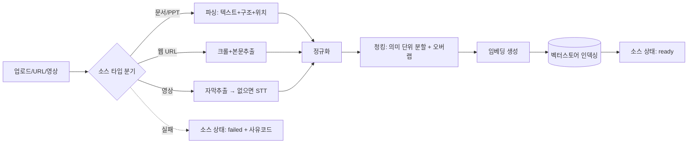
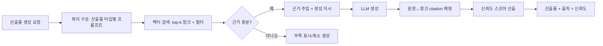
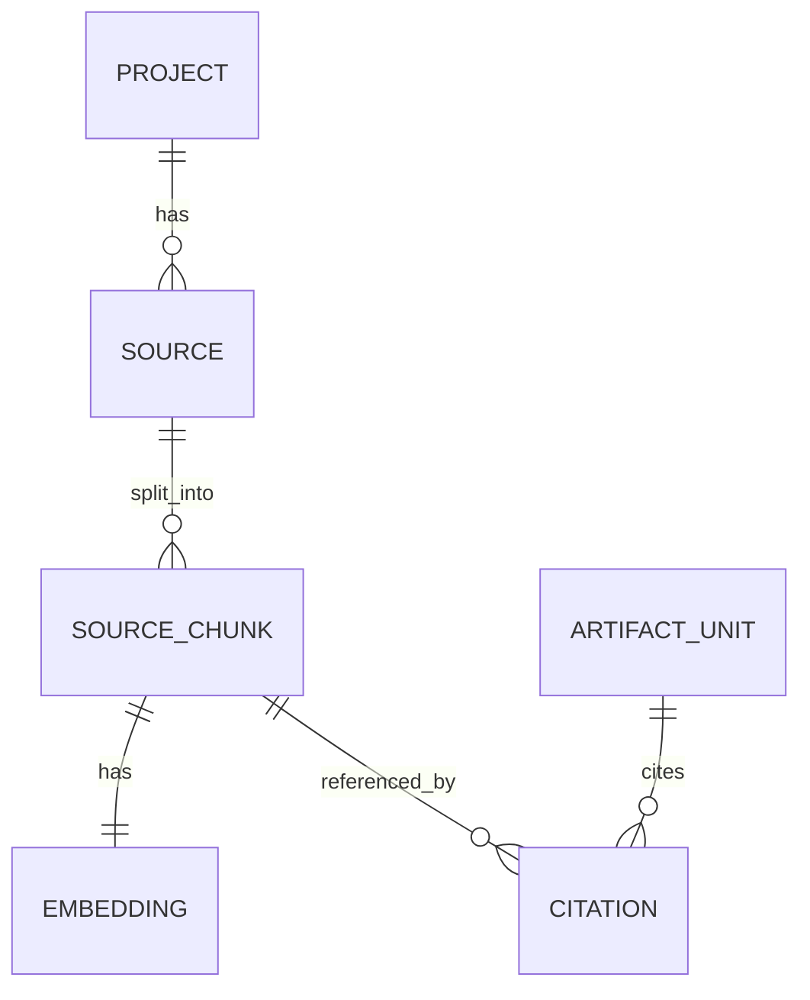

# 소스 인제스트 · 그라운딩 · 출처 표기 기획

> 담당 해자: **소스 그라운딩 / 출처 표기(NotebookLM급, 환각 차단)** — 국내 빈자리이자 신뢰성 마케팅 메시지.
> 정본 참조: `docs/planning/01-COMPETITION.md` (NotebookLM·Sana 벤치마크)
> 백엔드/AI 파이프라인 구현체: 형제 레포 `malgn-studio-api` (본 문서는 개념 수준 연결점만 정의)
> 기준 시점: 2026-06 / 추정은 "(가정)" 표기

---

## 목적

1. 사용자가 올린 **모든 입력 소스**(문서·텍스트·PPT·웹링크·영상)를 일관된 형태로 수집·정규화하여 RAG 인덱스로 만든다.
2. 8종 AI 산출물(영상·오디오·슬라이드·커리큘럼·콘티·퀴즈·문제은행·요약) 생성 시 **소스에 근거(grounding)** 하고, **모든 문장/항목에 출처(citation)를 매핑**한다.
3. **환각을 구조적으로 차단**한다: 소스 밖 주장 억제, 근거 부족 명시, 신뢰도 표시.
4. 결과적으로 "업로드한 자료 그대로, 출처까지 추적 가능한" 신뢰성을 제품의 전면 메시지로 만든다. 이는 휴넷·휴먼웨어즈 등 국내 경쟁사가 약한 지점(01-COMPETITION §3-2).

비목표(이 문서 범위 밖): 산출물별 렌더링/포맷(영상 합성·TTS 등), 스킬 태깅·개인화, LMS 발행·패키징(SCORM/xAPI).

---

## 핵심 접근

```
입력 소스(N종)  ─▶  파싱·정규화  ─▶  청킹  ─▶  임베딩  ─▶  벡터스토어 인덱싱
                  (텍스트+구조+위치)                         (소스별 네임스페이스)
                                                                  │
산출물 생성 요청 ─▶  검색(Retrieve) ─▶  근거 주입(Augment) ─▶  생성(Generate) ─▶  출처 매핑(Cite)
```

원칙 4가지:
- **소스 충실성(Source Fidelity)**: 청크에는 원문 텍스트 + **출처 위치 메타(페이지/타임코드/문단)** 를 항상 함께 저장 → 나중에 원문 하이라이트가 가능해야 한다.
- **추적 가능성(Traceability)**: 생성 산출물의 모든 단위(문장/슬라이드/문항)는 **0개 이상의 citation**을 가진다. citation 0개는 "근거 없음"으로 명시 처리.
- **소스 격리(Source Isolation)**: 한 학습물(project/notebook)에 속한 소스만 검색 대상. 타 프로젝트·모델 사전지식 혼입 차단(환각의 주 원인).
- **점진적 처리**: 인제스트는 비동기 잡. 소스별로 독립 처리되어 한 소스 실패가 전체를 막지 않는다.

---

## 지원 소스 · 포맷

### 소스 타입별 처리 개요

| 소스 타입 | 입력 방식 | 추출/처리 | 출처 위치 단위 | 주요 실패 케이스 |
|---|---|---|---|---|
| 문서(PDF) | 업로드 | 텍스트 레이어 추출 → 없으면 OCR(가정) | 페이지 번호 + 좌표 | 스캔본·암호화·손상 PDF |
| 문서(DOCX) | 업로드 | 문서 파서로 텍스트·제목 구조 추출 | 문단/제목 경로 | 복잡 표·임베디드 객체 |
| 문서(HWP/HWPX) | 업로드 | 전용 파서(HWPX 우선)·실패 시 변환 경유(가정) | 문단 인덱스 | 구버전 HWP·암호화 |
| 텍스트(TXT/MD) | 업로드·붙여넣기 | 그대로 정규화 | 문단/라인 | 인코딩(EUC-KR↔UTF-8) |
| 프레젠테이션(PPT/PPTX) | 업로드 | 슬라이드별 텍스트·발표자 노트 추출 | 슬라이드 번호 | 이미지 텍스트(OCR 필요) |
| 웹/홈페이지(URL) | 링크 입력 | 크롤 → 본문 추출(보일러플레이트 제거) | URL + 섹션 앵커 | JS 렌더링·로그인·robots 차단 |
| 영상(파일/URL) | 업로드·링크 | 자막(SRT/VTT) 우선 → 없으면 STT | 타임코드(시작~끝) | 자막 없음·다국어·긴 영상 |

### 지원 포맷 · 제한 표 (가정값)

| 포맷 | 추출 방식 | 한국어/HWP 고려 | 최대 크기(가정) | MVP 포함 |
|---|---|---|---|---|
| PDF | 텍스트 레이어, fallback OCR | 한국어 OCR 엔진 필요 | 50MB / 300p | ✅ |
| TXT / MD | 직접 | 인코딩 자동 감지(EUC-KR 포함) | 5MB | ✅ |
| 웹 URL | HTML 본문 추출 | 한국어 본문 추출 정확도 검증 필요 | 페이지당 ~2MB | ✅ |
| DOCX | 문서 파서 | 한국어 무관 | 30MB | ✅(2차) |
| PPTX | 슬라이드+노트 | 한국어 무관 | 50MB | △ 후속 |
| HWP / HWPX | HWPX 네이티브 파서 우선 | **핵심 — 국내 필수**, 구HWP 변환 의존 | 30MB | △ 후속(국내 차별화로 우선순위↑) |
| 영상(MP4 등) | 자막 → STT | 한국어 STT 품질이 관건 | 2GB / 2시간(가정) | ❌ 후속 |
| 오디오(MP3 등) | STT | 한국어 STT | 500MB | ❌ 후속 |

> 전 소스 공통 한도(가정): 프로젝트당 소스 50개, 총 텍스트 ~100만 토큰. 초과 시 분할 안내.

---

## 파이프라인 단계

### 인제스트(쓰기 경로)



단계 정의:
1. **수집/접수**: 파일 저장 또는 URL 접수 → `source` 레코드 생성(status=`pending`).
2. **파싱·추출**: 타입별 파서로 텍스트 + 구조(제목/슬라이드/문단) + **출처 위치 메타** 추출. status=`parsing`.
3. **정규화**: 공백·제어문자 정리, 인코딩 통일(UTF-8), 머리말/꼬리말·광고 제거(웹). 표는 가능한 한 텍스트로 직렬화.
4. **청킹**: 의미 단위(문단/슬라이드/자막 블록) 기준 분할 + 토큰 상한(가정: 청크당 ~500~800토큰, 오버랩 ~80토큰). 각 청크는 원본 위치 메타를 상속.
5. **임베딩**: 청크별 임베딩 벡터 생성(모델은 API 영역 결정사항 — 가정: 다국어/한국어 지원 임베딩).
6. **인덱싱**: 벡터스토어에 적재. **프로젝트별 네임스페이스 + 소스 ID 필터**로 격리. status=`ready`.
7. **실패 처리**: 임의 단계 실패 시 status=`failed`, 표준 사유코드 기록, 부분 성공 청크는 폐기(원자성, 가정).

### 그라운딩(읽기 경로 / 생성)



---

## 그라운딩 · 출처 UX

### RAG 그라운딩 동작

- 생성 시 산출물 단위(요약 문장, 슬라이드 항목, 퀴즈 문항 등)별로 **소스 청크를 검색→근거로 주입**한다.
- LLM에 "주어진 근거 안에서만 작성하고, 각 출력 단위에 사용한 청크 ID를 함께 반환하라"고 지시(구조화 출력, 가정).
- 반환된 청크 ID로 **citation 레코드를 생성**, 출력 단위에 연결.

### 출처 표기 UX (NotebookLM/Sana 벤치마크)

| 요소 | 동작 |
|---|---|
| 인용 칩(citation chip) | 문장/항목 끝에 `[1]` `[2]` 형태 번호 칩. 호버 시 출처 미리보기. |
| 출처 패널 | 산출물 옆 패널에 해당 청크 원문·소스명·위치(p.12 / 03:24 / 슬라이드 5) 표시. |
| 원문 하이라이트 | 칩 클릭 → 원본 소스 뷰어에서 해당 위치로 점프 + 근거 텍스트 하이라이트. |
| 근거 없음 배지 | citation 0개 단위는 회색 "근거 미확인" 배지로 시각 구분. |
| 신뢰도 표시 | 단위/산출물 수준 신뢰도(높음/보통/낮음) 색상 인디케이터(가정). |

> 핵심 UX 약속: **"이 문장은 어디서 나왔는가?"에 항상 한 번의 클릭으로 답한다.** 이것이 환각 차단을 사용자에게 보여주는 방식.

---

## 환각 차단 정책

| 정책 | 메커니즘 |
|---|---|
| 소스 밖 주장 억제 | 시스템 프롬프트로 "주입된 근거 외 사전지식 사용 금지" 강제 + 소스 격리 검색. |
| 근거 부족 표시 | 검색 top-k 유사도가 임계치 미달이면 해당 단위를 생성하지 않거나 "근거 미확인"으로 표시. |
| citation 강제 | 산출물 단위는 청크 ID 동반 필수. 미동반 단위는 후처리에서 "근거 없음" 처리. |
| 신뢰도 스코어(가정) | 검색 유사도 + citation 커버리지 + 근거 청크 수를 가중 합산해 0~1 점수 산출. 임계치 미만은 사용자/HITL 검수 플래그. |
| 사후 검증(후속) | 생성 문장과 인용 청크 간 일치성(entailment) 재확인 모델(가정). |

신뢰도 스코어 초안(가정):
```
confidence = w1·avg(retrieval_similarity) + w2·citation_coverage + w3·min(1, cited_chunks/expected)
citation_coverage = (citation 보유 단위 수) / (전체 출력 단위 수)
```

---

## 데이터 모델 초안



> `PROJECT`(학습물/노트북)·`ARTIFACT_UNIT`(산출물 내 문장/항목)은 타 문서 소관 — 여기선 외래키로만 참조.

### source
| 필드 | 타입(가정) | 설명 |
|---|---|---|
| id | uuid | PK |
| project_id | uuid | 소속 프로젝트(격리 키) |
| type | enum | pdf/docx/hwp/txt/ppt/web/video/audio |
| origin | text | 파일경로 또는 URL |
| title | text | 표시 이름 |
| status | enum | pending/parsing/ready/failed |
| failure_code | text\|null | 실패 사유 코드 |
| meta | json | 페이지수·길이·언어·체크섬 등 |
| created_at | timestamp | |

### source_chunk
| 필드 | 타입 | 설명 |
|---|---|---|
| id | uuid | PK |
| source_id | uuid | FK → source |
| seq | int | 소스 내 순번 |
| text | text | 정규화된 청크 원문 |
| locator | json | 위치: `{page, bbox}` / `{timecode_start,end}` / `{slide}` / `{para}` |
| token_count | int | |

### embedding
| 필드 | 타입 | 설명 |
|---|---|---|
| chunk_id | uuid | FK → source_chunk (1:1) |
| vector | vector(dim) | 임베딩 (차원=모델 의존, 가정) |
| model | text | 임베딩 모델 식별자 |
| namespace | text | `project_id` 기반 격리 네임스페이스 |

### citation
| 필드 | 타입 | 설명 |
|---|---|---|
| id | uuid | PK |
| artifact_unit_id | uuid | FK → 산출물 단위(문장/항목/문항) |
| chunk_id | uuid | FK → source_chunk |
| relevance | float | 검색 유사도/근거 강도 |
| display_index | int | UI 인용 번호 `[n]` |

---

## API 연결점 (개념 수준 — 구현은 `malgn-studio-api`)

> 형제 레포가 현재 비어 있어(greenfield) 아래는 **계약 제안(가정)**. 확정은 API 팀 협의.

| 목적 | 엔드포인트(가정) | 설명 |
|---|---|---|
| 파일 업로드 | `POST /v1/sources/upload` | multipart 또는 사전서명 URL 발급. `source`(pending) 생성. |
| URL 소스 등록 | `POST /v1/sources/url` | 웹/영상 링크 접수 → 인제스트 잡 큐잉. |
| 인제스트 잡 상태 | `GET /v1/sources/{id}` | status·진행률·failure_code 조회(폴링/웹훅). |
| 소스 목록 | `GET /v1/projects/{id}/sources` | 프로젝트 내 소스 + 상태. |
| 근거 검색(내부) | `POST /v1/projects/{id}/retrieve` | query→top-k 청크. 산출물 생성기가 호출(내부 전용). |
| 산출물별 출처 | `GET /v1/artifacts/{id}/citations` | 산출물 단위↔청크 citation + locator 반환(출처 패널용). |
| 소스 삭제 | `DELETE /v1/sources/{id}` | 청크·임베딩·citation 캐스케이드. |

비동기 잡 모델(가정): 업로드/등록은 즉시 `pending` 반환 → 워커가 파싱~인덱싱 수행 → 완료 시 웹훅/SSE로 상태 통지.

---

## MVP vs 후속

| 구분 | MVP | 후속 |
|---|---|---|
| 소스 타입 | **PDF · 텍스트(붙여넣기/TXT/MD) · 웹 URL** | DOCX → PPTX → **HWP/HWPX**(국내 차별화로 조기 승격 검토) → 영상/오디오 |
| 영상 STT | ❌ | ✅ 자막 추출 우선, STT는 한국어 품질 확보 후 |
| OCR(스캔 PDF) | 제한적/경고 | 정식 한국어 OCR |
| 그라운딩 | ✅ 검색→근거주입→citation 매핑(전 MVP 산출물 적용) | entailment 사후검증 |
| 출처 UX | ✅ 인용 칩 + 출처 패널 + 위치 점프 | 원문 인라인 하이라이트 고도화 |
| 환각 차단 | ✅ 소스 격리 + citation 강제 + 근거부족 표시 | 신뢰도 스코어 정교화 + HITL 연동 |

MVP 선정 근거: PDF·텍스트·웹은 추출 난도가 낮고 즉시 그라운딩 효용을 보여줄 수 있어, "출처 표기" 차별화 메시지를 가장 빠르게 증명한다(01-COMPETITION §3-1 속도 우선). HWP는 국내 필수이나 파서 리스크가 있어 별도 검증 트랙으로 분리하되 우선순위를 높게 둔다.

---

## 미정 · 가정

- **임베딩/벡터스토어 선정**: 모델 차원·다국어 품질·온프레미스 여부 모두 API 팀 결정(미정).
- **한국어 STT/OCR 엔진**: 자체 vs 외부 API, 한국어 정확도 기준 미정(가정: 외부 API 우선).
- **HWP 파싱 경로**: HWPX 네이티브 vs 변환 경유, 구버전 HWP 커버리지 미정.
- **신뢰도 스코어 가중치(w1·w2·w3)**: 데이터로 튜닝 필요(가정값).
- **크기·개수 한도 수치**: 표 안의 MB/토큰/시간 값은 전부 (가정) — 비용·인프라 확정 후 조정.
- **웹 크롤 정책**: robots.txt 준수·로그인 페이지·JS 렌더링 처리 범위 미정.
- **citation 단위 입도**: 문장 단위 vs 항목 단위 — 산출물 타입별 상이, UX 협의 필요.
- **저작권/약관**: 업로드·크롤 소스의 권리 처리 정책은 법무·정책 영역(범위 밖, 의존).
