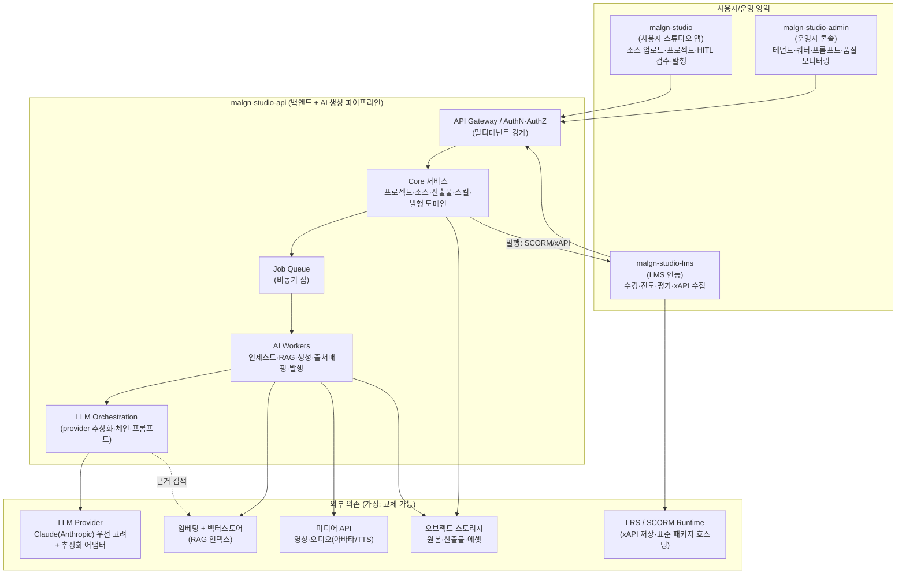
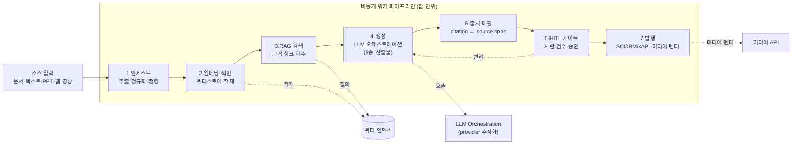
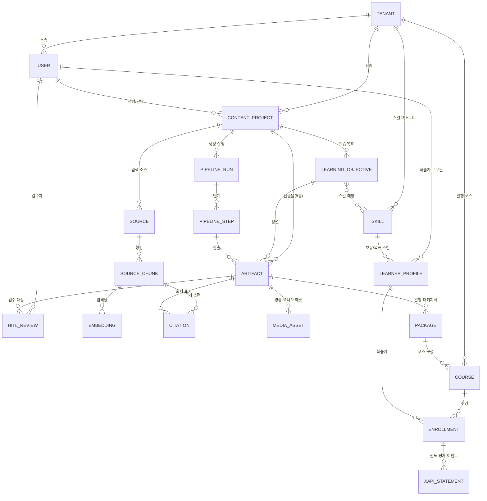

# 기술 아키텍처 — 맑은스튜디오(Malgn Studio)

> 정본: [01-COMPETITION.md](./01-COMPETITION.md)(경쟁/해자), 도메인 상세는 04~08 문서가 정본.
> 이 문서는 **전체 시스템 구성·AI 생성 파이프라인·통합 데이터 모델 관계도**를 다룬다.
> 모델·인프라 구체 스택은 미정. 추정은 "(가정)" 표기.

---

## [목적]

- 4개 형제 레포(`malgn-studio`·`-admin`·`-api`·`-lms`)와 외부 의존(LLM provider, 임베딩/벡터스토어, 미디어 API, 스토리지, LRS)의 **경계와 책임**을 한 장으로 정의한다.
- 해자(그라운딩·스킬 개인화·표준 발행·HITL)를 떠받치는 **AI 생성 파이프라인**(인제스트→RAG→생성→출처 매핑→HITL→발행)을 비동기·멱등·관측 가능하게 설계한다.
- 여러 도메인 문서에 흩어진 엔티티를 **하나의 ERD**로 통합해 전체 관계의 정본 그림을 제공한다.
- provider 추상화로 LLM·미디어·벡터스토어를 **교체 가능**하게 유지(가정), 멀티테넌트 권한 경계를 명시한다.

---

## [구성요소]

### 1. 시스템 구성도

**경계와 책임**

| 컴포넌트 | 책임 | 비책임(경계) |
|---|---|---|
| `malgn-studio` | 소스 업로드, 프로젝트 편집, 8종 산출물 검토, HITL 검수 UI, 발행 트리거 | 생성 연산 자체(서버 위임), 모델 호출 |
| `malgn-studio-admin` | 테넌트/사용자/권한, 크레딧·쿼터, 프롬프트·체인 버전, 품질·비용 모니터링 | 사용자 콘텐츠 직접 생성 |
| `malgn-studio-api` | **단일 진입점**: 도메인 로직 + AI 파이프라인(잡 큐·워커·오케스트레이션) | 프런트 렌더링, LMS 수강 런타임 |
| `malgn-studio-lms` | 발행물 수강·진도·평가, xAPI 이벤트 수집, LMS 연동 | 콘텐츠 생성, 소스 인제스트 |
| LLM provider (외부) | 텍스트 생성·요약·구조화 출력 | — (provider 추상화 뒤) |
| 임베딩/벡터스토어 (외부) | 청크 임베딩, 유사도 검색(RAG) | 원본 보존(스토리지 책임) |
| 미디어 API (외부) | 영상·오디오 합성 | 스크립트/콘티 생성(우리 책임) |
| 스토리지 (외부) | 원본·산출물·에셋 바이너리 보존 | 메타데이터(DB 책임) |
| LRS/Runtime (외부) | xAPI statement 저장, 표준 패키지 호스팅 | 발행 패키징(api 책임) |

### 2. AI 생성 파이프라인

**잡 큐·워커·오케스트레이션 원칙**

- **비동기 잡 단위**: 각 단계는 독립 잡(`pipeline_run` 하위 `pipeline_step`)으로 큐에 적재, 워커가 소비. 생성·미디어 렌더는 지연이 크므로 동기 응답 금지.
- **멱등(idempotency)**: 잡마다 `idempotency_key`(= 소스 버전 해시 + 단계 + 파라미터 해시). 재실행 시 동일 키면 기존 산출물 재사용 → 중복 LLM/미디어 과금 차단.
- **재시도**: 일시 오류(429/5xx/타임아웃)는 지수 백오프 재시도, 영구 오류(검증 실패)는 즉시 실패 처리 후 운영 알림. 부분 실패 단계만 재개(체크포인트).
- **관측(observability)**: 잡별 토큰·비용·지연·모델·provider, RAG 적중률, 출처 매핑률, HITL 반려율을 구조화 로깅 → admin 대시보드. 모든 응답에 `request_id`/`trace_id` 보존(가정).
- **LLM 오케스트레이션**: 산출물 종류별 체인(요약/슬라이드/퀴즈/콘티…)을 프롬프트·단계 정의로 버전 관리. 긴 입력/출력은 스트리밍 처리(가정). 적응형 사고(adaptive thinking) 기본(가정).

### 3. 모델/LLM 전략

- **provider 추상화**: 모든 생성은 `LLMProvider` 인터페이스(요청/응답/스트림/토큰계측 표준화)를 통해 호출. 어댑터로 provider 교체 가능. 맑은소프트는 **Claude(Anthropic) 계열 우선 고려**(가정), 기본 모델 `claude-opus-4-8`(가정). provider별 모델 ID·파라미터 차이는 어댑터가 흡수.
- **프롬프트/체인 관리**: 프롬프트·체인을 코드 외부 자원(`prompt_template`/`chain_def`, 버전·테넌트 오버라이드)으로 관리, admin에서 롤백 가능. 안정 프리픽스(시스템·도구) → 가변 입력 순서로 배치해 캐싱 친화적 구성(가정).
- **비용·토큰 관리**: 호출 전 토큰 카운트로 예상 비용 산정, 테넌트 크레딧/쿼터와 연동. 캐싱(반복 컨텍스트)·배치(비실시간 대량) 활용으로 비용 절감(가정). 산출물 종류별 effort/모델 등급 차등(요약=경량, 장문 분석=상위)(가정).
- **그라운딩 우선**: 생성은 RAG 근거 청크에 한정, 근거 없는 주장 차단 → 출처 매핑 단계에서 citation 강제(해자: 환각 차단).

### 4. 스토리지 (관심사 분리)

| 스토어 | 내용 | 비고 |
|---|---|---|
| 원본 소스 스토어 | 업로드 원본(문서·PPT·영상)·웹 스냅샷 | 불변·버전 보존, 격리(테넌트별) |
| 산출물 스토어 | 8종 산출물 렌더 결과·발행 패키지(SCORM zip 등) | 버전·발행 상태별 |
| 미디어 에셋 스토어 | 외부 API가 생성한 영상·오디오 바이너리·썸네일·자막 | 미디어 잡 결과 |
| 벡터 인덱스 | 청크 임베딩·메타(소스/스팬 참조) | RAG 검색 전용, 원본은 미보존 |
| 관계형 메타 DB | 엔티티·관계·상태·잡·감사(통합 데이터 모델) | 아래 ERD |

> 바이너리(스토리지)와 메타데이터(DB)를 분리. 벡터 인덱스는 검색용 파생물이며 원본 정본은 원본 스토어.

### 5. 통합 데이터 모델 초안 (전체 관계 ERD)

> 각 도메인 상세 필드는 해당 문서가 정본. 여기서는 **엔티티 간 관계의 전체 그림**만 제시한다.

**엔티티 역할 요약(관계 정리용)**

| 엔티티 | 역할 | 정본 문서(가정) |
|---|---|---|
| `tenant` | 멀티테넌트 경계, 모든 데이터의 최상위 소유자 | 09(본문) |
| `user` | 테넌트 내 사용자(작성자·검수자·학습자 역할) | 09/10 |
| `source` / `source_chunk` / `embedding` | 입력 소스·청킹·벡터(RAG 기반) | 04 |
| `content_project` | 빌더 작업 단위(소스→산출물 묶음) | 03/05 |
| `learning_objective` | 교수설계 학습목표 | 05 |
| `artifact` | 8종 산출물 인스턴스(버전·상태 포함) | 05 |
| `citation` | 산출물 ↔ 소스 스팬 출처 매핑(해자) | 04/05 |
| `media_asset` | 외부 API 영상·오디오 결과물 | 06 |
| `pipeline_run` / `pipeline_step` | 생성 실행·단계(멱등·재시도·관측 단위) | 09(본문) |
| `hitl_review` | 사람 검수 게이트 기록 | 05 |
| `skill` | 스킬 택소노미 노드 | 07 |
| `learner_profile` | 학습자 스킬·이력(개인화) | 07 |
| `package` | 표준 발행 패키지(SCORM/xAPI) | 08 |
| `course` / `enrollment` | LMS 코스·수강 | 08 |
| `xapi_statement` | 진도·평가 학습 이벤트(LRS) | 08 |

### 6. 인증·테넌시 (가정)

- **멀티테넌시**: 모든 1차 엔티티에 `tenant_id` 부여, 모든 쿼리·스토리지 경로·벡터 인덱스 네임스페이스를 테넌트로 격리. 업로드 소스·산출물은 테넌트 간 절대 비공유.
- **인증**: API Gateway에서 토큰 검증, 서비스 간 호출은 내부 신뢰 경계. 외부 provider 시크릿은 시크릿 매니저 보관, 코드·프롬프트·로그에 미노출(가정).
- **권한 경계(역할, 가정)**: 작성자(프로젝트 편집)·검수자(HITL 승인/반려)·운영자(테넌트·쿼터·프롬프트)·학습자(수강) 분리. 발행/반려 등 비가역 작업은 권한 게이트 + 감사 로그.
- **데이터 경계**: 벡터스토어·미디어 API 등 외부 의존에도 테넌트 식별자 전파, 외부에 보낸 콘텐츠 범위·보존을 추적(컴플라이언스: [12-NFR.md](./12-NFR.md)).

---

## [데이터 흐름]

1. **인제스트**: 사용자가 `malgn-studio`에서 소스 업로드 → `api`가 원본 스토어 보존 + `source`/`source_chunk` 생성 → 임베딩 잡으로 벡터 인덱스 적재.
2. **생성 요청**: 사용자가 프로젝트에서 산출물 생성 트리거 → `api`가 `pipeline_run` 생성, 단계별 잡을 큐에 적재.
3. **RAG→생성→출처**: 워커가 RAG로 근거 청크 회수 → 오케스트레이션이 provider(Claude 우선, 가정) 호출로 산출물 생성 → 출처 매핑으로 `citation` 부착.
4. **미디어**: 영상·오디오 산출물은 미디어 API로 렌더 → `media_asset`로 보존.
5. **HITL**: 검수자가 `hitl_review`로 승인/반려. 반려 시 생성 단계 재개.
6. **발행**: 승인 산출물을 `package`(SCORM/xAPI)로 패키징 → `course` 구성 → `malgn-studio-lms`로 발행.
7. **수강·진도**: 학습자가 `enrollment`로 수강 → `xapi_statement`가 LRS에 수집 → 진도·평가가 개인화(`learner_profile`)로 환류.

---

## [데이터 모델 통합]

- **단일 정본 관계도**: 위 ERD가 전체 엔티티 관계의 정본. 각 도메인의 필드·상태 머신은 해당 문서(04~08)가 정본이며, 본 문서는 **외래키 관계와 경계**만 고정한다.
- **그라운딩 체인**: `source → source_chunk → embedding`(검색) 과 `source_chunk → citation → artifact`(출처) 가 환각 차단 해자의 데이터 근간.
- **개인화 체인**: `learning_objective ↔ skill ↔ learner_profile`로 스킬 기반 개인화 연결.
- **발행 체인**: `artifact → package → course → enrollment → xapi_statement`로 표준 발행·LMS 연동 연결.
- **실행/감사 체인**: `pipeline_run → pipeline_step → artifact`로 멱등·재시도·관측·감사 추적.

---

## [미정·가정]

- **모델·인프라 스택 미정**: LLM provider(Claude 우선 고려, 가정), 임베딩/벡터스토어 제품, 미디어 API 벤더, 큐·워커 런타임, 스토리지·DB 제품 모두 미정.
- **(가정)** provider 추상화로 LLM·미디어·벡터스토어 교체 가능, 기본 LLM `claude-opus-4-8`, 적응형 사고·스트리밍 사용.
- **(가정)** 멱등 키 = 소스 버전 해시 + 단계 + 파라미터 해시. 부분 실패 시 단계 단위 재개.
- **(가정)** 멀티테넌시는 `tenant_id` 행 격리 + 벡터 네임스페이스 격리. 강격리(테넌트별 인덱스/버킷) 여부 미정.
- **미정**: 역할 권한 매트릭스 세부, LRS/SCORM 런타임 자체 호스팅 vs 외부, 미디어 제휴(예: 브루) 연동 깊이.
- **참조**: 비기능 목표·전략은 [12-NFR.md](./12-NFR.md).
